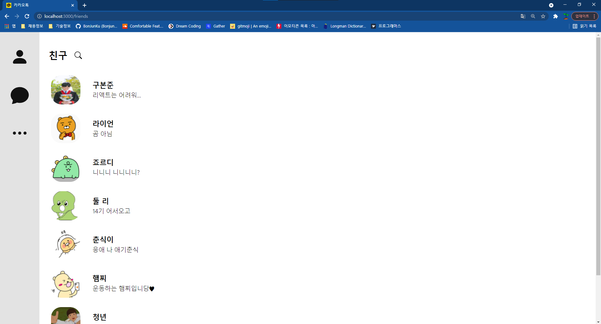
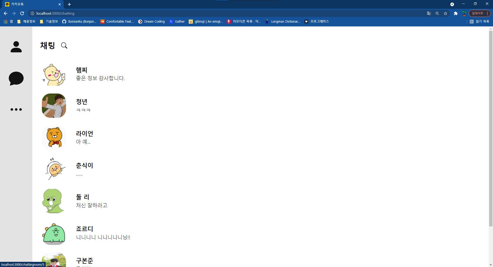
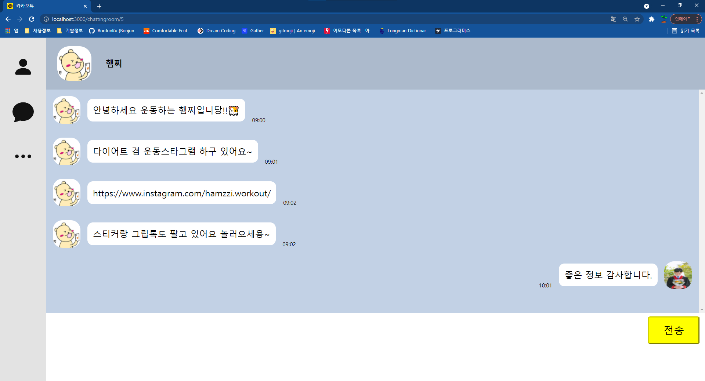
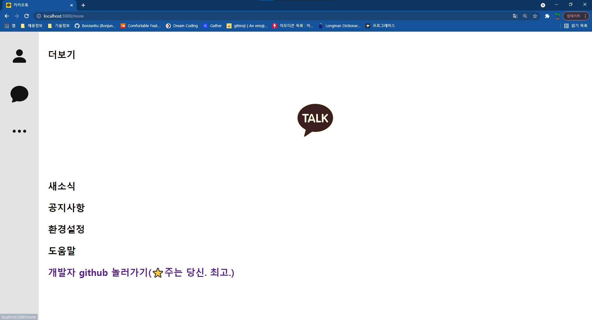

# 🙌 Introduction

이 저장소는 IT창업동아리 CEOS(https://www.ceos.or.kr/) 프론트엔드 팀에서 스터디를 하며 수행한 미션의 결과를 공유합니다.

# 🚩 미션 내용

- 원문링크: https://github.com/CEOS-Developers/react-messenger-14th
- CEOS 3주차 미션은 react를 이용하여 메신저를 클론 코딩하는 것입니다. 채팅방 한 개만 만들고, 상단의 프로필을 누르면 프로필이 바뀌는 대화방을 구현하는 것이 미션 내용이었습니다.
- CEOS 4주차 미션은 3주차 미션을 발전시켜서, react-router-dom 등을 이용해 네비게이션 바를 만들고, 여러 명의 친구목록/대화방을 구현하는 것이 미션이었습니다.
- CEOS 5주차 미션은 4주차 미션을 발전시켜서, TypeScript를 도입하고 리액트의 HOC, custom Hooks를 통해 반복되는 구조를 최소화하는 것이 미션이었습니다.

# 🚩 결과물

- 배포 주소 : https://react-messenger-14th-one.vercel.app
- 예시 화면

1. 홈 화면
   
2. 친구 목록 화면
   
3. 채팅방 목록 화면
   
4. 채팅방 내부
   
5. 더보기
   

# 🚩 프로그램 기능

- [x] 친구목록/ 채팅목록 조회 기능
- [x] 친구목록/ 채팅목록 상에서 검색 기능
- [x] 친구별 대화방 존재
- [x] 채팅데이터 JSON으로 관리
- [x] 대화 시 시간 기록, JSON파일에 업데이트
- [x] 상단프로필 클릭 시 프로필 바뀌는 기능
- [x] 채팅 입력 시 자동으로 하단으로 스크롤되는 기능
- [x] 빈 메세지 입력시 alert

## 😀 로컬 실행방법

`npm start` : 로컬에서 react application을 자동으로 리로드하여 실행시켜줍니다.

## 😀 겪었던 문제들 & 해결 방법 + 새로 배운 내용:

- vercel로 배포시 빌드 설정 오류:
  https://github.com/vercel/vercel/discussions/5566
- 데이터가 오지 않았을 때 : 옵셔널 체이닝 활용
- 프로필 전환 관련 오류: 해결 완료
- npm install -D = npm install --save-dev, 이 옵션이 있는 이유를 알게 되었다.(devDependency)
- 제네릭은 정의를 위한 것이다.
- type만 imort할 때는 import type {}으로 해야한다. 그냥 타입 이름을 import하면 값이 가져와진다.
- typescript의 타입추론기능을 최대한 활용해야 한다. 컴포넌트 추출과정에서 추출 후 타입을 넣기보다는 타입추론으로 타입을 입력해 놓고 분리시키는 것이 수월하다.abs

## 😀 느낀 점

- 5주차 미션이 제일 힘들었습니다. 완벽하게 구현을 하지도 못했구요😭
- 제일 힘들었던 이유는 업보 풀스택 때문인 것 같습니다..
- 업보라 함은, 공식문서 안 읽은 업보라고 할 수 있습니다. 지난 주에 기욱님 코드를 보는데 진짜 잘 모르겠어서.. 더 늦기 전에 쭉 공식문서를 읽어야겠다고 생각했답니다..(감사해요..ㅎㅎ)
- 그래서 이번 미션 진행 과정에서 코딩은 하루-이틀 정도만 했고.. 나머지는 공부를 한 것 같습니다.
- https://zaraza.tistory.com/62 이런 식으로 읽으면서 정리를 수행했습니다. 처음 시작하기부터 읽으니 시간이 꽤 오래 걸렸습니다.(다 읽지는 못했습니다만.. 꽤 읽었어요)
- 그래서 공식문서 위주의 코딩(?)을 해보려고 했는데 이건 더 어려웠습니다.(벨로퍼트 등.. 참고 안하고 싶었습니다)
- 제일 어려웠던 부분은, useReducer+typescript+contextAPI가 만나는 순간이었습니다. 하하!
- 그래도 이전까지 리액트를 할 때는 컴포넌트도 렌더 안에 뭉탱이로 쌓아놓는 식으로 했는데.. 쪼개는 걸 이번에 처음 해본 것 같습니다. custom Hooks를 쓰니 코드가 정말 간결해지는 걸 경험했습니다.
- 아래 예시는 친구 목록을 보여주는 컴포넌트인데, 개선 전/후 비교하면 이렇답니다. 이게 제일 뿌듯했어요. ~~채팅방은 아직..~~
  <br />

[개선 전]

```JavaScript
const Friends = ({ users, setUsers }) => {
  const [searchingText, setSearchingText] = useState('');
  const [isSearching, setIsSearching] = useState(false);
  const [currentUsers, setCurrentUsers] = useState(users);

  const handleChange = (e) => {
    setSearchingText(e.target.value);
    setCurrentUsers(users.filter((e) => e.name.indexOf(searchingText) > -1));
    return;
  };

  const handleClickSearch = () => {
    setIsSearching(!isSearching);
  };

  useEffect(() => {
    if (isSearching) {
    } else {
      setCurrentUsers(users);
    }
  }, [users, isSearching]);

  return (
    <FriendsContainer>
      <Header>
        <FriendsPageTitle>친구</FriendsPageTitle>
        <SearchButton onClick={handleClickSearch}>
          <BsSearch />
        </SearchButton>
      </Header>
      {isSearching && (
        <>
          <SearchBar
            onKeyUp={handleChange}
            placeholder="검색어를 입력하세요."
            onFocus={(e) => (e.target.placeholder = '')}
            onBlur={(e) => (e.target.placeholder = '검색어를 입력하세요.')}
          />
          <CloseButton onClick={handleClickSearch}>
            <GrClose />
          </CloseButton>
        </>
      )}
      <FriendsList>
        {currentUsers &&
          currentUsers.map((element) => (
            <FriendsListItem key={element.id} user={element}></FriendsListItem>
          ))}
      </FriendsList>
    </FriendsContainer>
  );
};
```

[개선후]

```JavaScript
const Friends = () => {
  // context로부터 state = users데이터를 받아옴.
  const { state } = useContext(UsersContext);

  // custom Hooks
  const { currentUsers, handleClickSearch, handleChange, isSearching } =
    useCurrentUsers(state);

  return (
    <FriendsContainer>
      {PageHeader('친구', handleClickSearch, handleChange, isSearching)}
      <FriendsList>
        {currentUsers &&
          currentUsers.map((element: User) => (
            <FriendsListItem key={element.id} user={element}></FriendsListItem>
          ))}
      </FriendsList>
    </FriendsContainer>
  );
};
```

- 이번 한 주도 수고하셨습니다.
